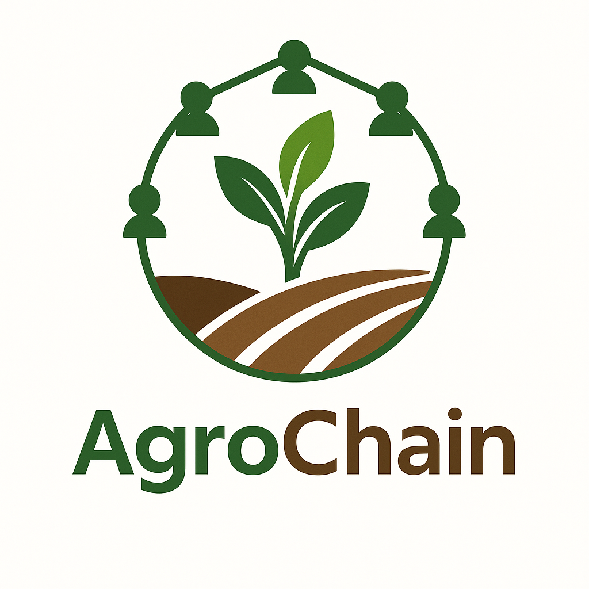
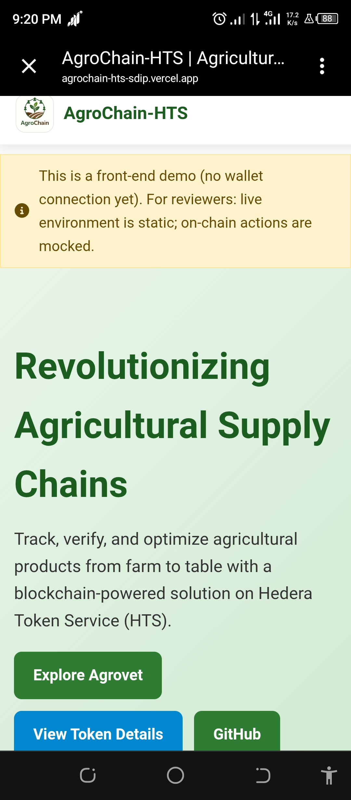
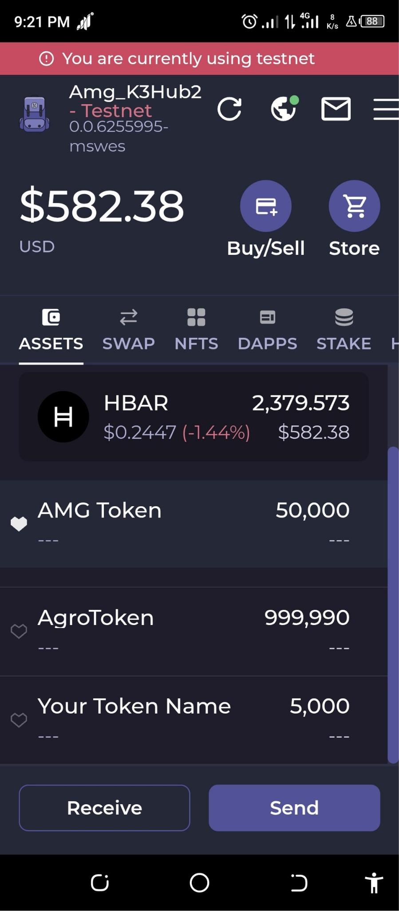

# 🌾 Agrochain-HTS

**Agrochain-HTS** is a decentralized agricultural tokenization platform powered by the **Hedera Token Service (HTS)**.  
Our mission is to digitize the agricultural value chain while empowering farmers, livestock owners, and local markets with transparent, verifiable, and inclusive technology.  

---

## 📋 Table of Contents
- [Features](#-features)
- [How It Works](#-how-it-works)
- [Demo](#-demo)
- [Screenshots](#-screenshots)
- [About Us](#-about-us)
- [Agrovet Initiative](#-agrovet-initiative)
- [Team Members](#-team-members)
- [Tech Stack](#-tech-stack)
- [Token Specification](#-token-specification)
- [Tokenomics](#-tokenomics)
- [Roadmap](#-roadmap)
- [Contact Info](#-contact-info)
- [License](#-license)

---

## 🔧 Features
- 🌱 **HTS Token Creation** (AgroToken + Testnet Tokens)
- 🔄 **Transfer Simulation / Distribution**
- 🔍 **Transparency** in local cooperatives and livestock markets
- 📈 **Expandable** via EVM contracts
- 🐄 **Livestock Health & Training** through Agrovet
- 🛒 **Marketplace Integration** for both rural and urban communities

---

## 💡 How It Works
1. Farmers receive **AgroTokens** for each verified harvest or livestock health record.
2. Tokens can be spent in local partner markets or redeemed for inputs.
3. Livestock owners get access to modern training on animal care via **Agrovet**.
4. Future smart contracts will manage **rewards, savings, and loans**.

---

## 🎬 Demo
[Watch on YouTube](https://youtube.com/watch?v=hWaUthuscxw)  
[Live Demo on Vercel](https://agrochain-hts.vercel.app/)

---

## 🖼 Screenshots
### Homepage

### Token Dashboard

---

## 🌍 About Us
We are a grassroots tech-agro innovation team based in **Katsina, Nigeria**, committed to transforming agriculture through decentralized and inclusive technology.  
Our journey began with educating over **3,000 people** about Web3 and Pi Network, and now we're building practical blockchain tools using **Hedera Hashgraph**.

---

## 🐮 Agrovet Initiative
Agrovet works alongside Agrochain-HTS to:
- Provide **animal healthcare services** and modern livestock training for youth.
- Educate communities on **best practices in animal feeding, milking, and disease prevention**.
- Visit farms and grazing areas to support livestock owners.
- Promote **fair trade** between rural and urban livestock markets.
- Improve **animal welfare standards** across African communities.

---

## 👥 Team Members
### 1. Abdulkadir Muhammed Gidado
- 📌 **Role:** Project Lead / Developer
- 📧 Email: amgk3hotline@gmail.com
- 🐦 Twitter: [@Amg_k3Hub](https://twitter.com/Amg_k3Hub)
- 💬 Telegram: [@AMG_K3HUB1](https://t.me/AMG_K3HUB1)

### 2. Nura Muhammad Hassan
- 📌 **Role:** Field Lead / Community Organizer
- 💬 Telegram: [@hassannura](https://t.me/hassannura)

### 3. Muhammadu Ado Duwan
- 📌 **Role:** Tech Support / Outreach Coordinator
- 💬 Telegram: [@Muhdwakili](https://t.me/Muhdwakili)

### 4. Jeffumista
- 📌 **Role:** Research & Documentation
- 💬 Telegram: *Coming soon...*

---

## 💻 Tech Stack
- Hedera HTS
- Optional: EVM / Solidity
- GitHub + DoraHacks + YouTube

---

## 🪙 Token Specification
### AgroToken
- **Name:** AgroToken
- **Symbol:** AGRO
- **Type:** Fungible Token (HTS)
- **Decimals:** 2
- **Initial Supply:** 1,000,000 AGRO
- **Max Supply:** 10,000,000 AGRO
- **Treasury Account:** `0.0.9341135`
- **Admin Key:** Agrochain Team
- **Supply Key:** Governance contract (future)

**Logic:**
- Minting up to max supply
- Burn unused AGRO
- Peer-to-peer transfers

**Use Cases:**
1. Reward farmers for produce
2. Discount on agro inputs
3. Loyalty points
4. Premium dApp services

---

## 💰 Tokenomics
| Category              | Allocation | Description |
|-----------------------|------------|-------------|
| Community Rewards     | 40%        | Farmers, partners, contributors |
| Team & Founders       | 20%        | Locked 1yr, vested 24 months |
| Partnerships & Grants | 15%        | Hackathons & collaborations |
| Liquidity Reserve     | 15%        | Exchanges & utility pools |
| Operations & Treasury | 10%        | Audits, sustainability |

---

## 🗺 Roadmap
### ✅ Phase 1: MVP Development (July 2025)
- Repo & structure setup
- HTS Token specs
- Demo video

### 🚧 Phase 2: Testing & Feedback (Aug–Sep 2025)
- Simulated token usage
- Mock campaigns

### 🚀 Phase 3: Pilot Deployment (Oct–Nov 2025)
- Deploy AgroToken on Hedera Testnet
- Partner with real farming groups

### 🌐 Phase 4: DAO & Community Layer (2026)
- On-chain voting
- Educational training
- Inter-chain integration

---

## 📞 Contact Info
**Organization:** Bin Kado Agro Pro Enterprises  
**Location:** Dutsin Safe Low-Cost, Katsina, Nigeria  
**Phone:** +234 803 557 9935  

---

## 🛡 License
This project is licensed under the [MIT License](./LICENSE).  
© 2025 Binkado2014 — All rights reserved.
